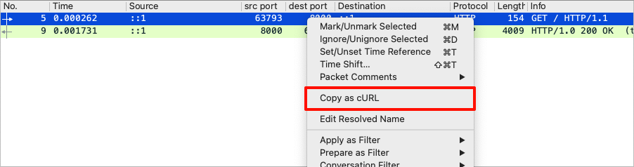

# Copy as cURL for wireshark

A lua plugin that add `Copy as cURL` context menu to wireshark, that could
copy http request as cURL command.

## Requirements

- Wireshark >= 4.2

## Installation

Put the `copy_as_curl.lua` file in the [Personal Plugin folders](https://www.wireshark.org/docs/wsug_html_chunked/ChConfigurationPluginFolders.html). Normally they are:

- On Windows, the plugin folder is usually `C:\Users\username\AppData\Roaming\Wireshark\plugins`
- On Linux, the plugin folder is usually `~/.local/lib/wireshark/plugins`
- On Mac, the plugin folder is usually `~/.local/lib/wireshark/plugins`

A list of the folders Wireshark actually uses can be found under the Folders tab in the dialog box shown when you select About Wireshark from the Help menu.

## Limits

- Only json payload and mutipart are considered for now.
